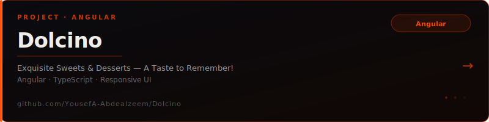
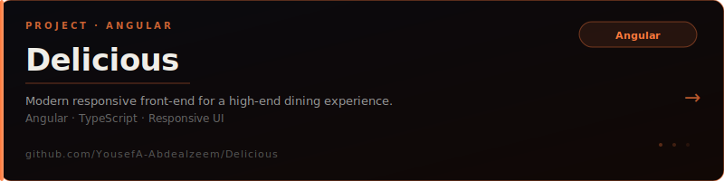
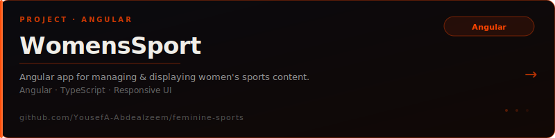

 

 

`Graduate of Computer Science @ EELU University (QU Branch) 🎓`

  

---

## Front-end developer who turns ideas into clean, fast interfaces.

Based in **Egypt 🇪🇬** — I focus on building polished UIs with Angular & TypeScript, writing maintainable code, and shipping real products. Currently **open to work 🚀**

---

## `01` — About Me

---

## `02` — What I've Shipped

 

<!-- ① Dolcino -->

 

<!-- ② Delicious -->

 

<!-- ③ WomensSport -->

 

<!-- ④ & ⑤ Placeholders — replace src with your new card SVGs when ready -->

 

---

## `03` — Stack

**━━━━━━━━━━━━━━━━ Languages ━━━━━━━━━━━━━━━━**

**━━━━━━━━━━━━━━━━ Frameworks & Libraries ━━━━━━━━━━━━━━━━**

**━━━━━━━━━━━━━━━━ Database ━━━━━━━━━━━━━━━━**

**━━━━━━━━━━━━━━━━ Design & Tools ━━━━━━━━━━━━━━━━**

---

## `04` — GitHub Analytics

&nbsp;

  

  

---

## `05` — Let's Connect

*Open to collaborations, front-end discussions, and new opportunities*

 

&nbsp;

&nbsp;

&nbsp;

 

